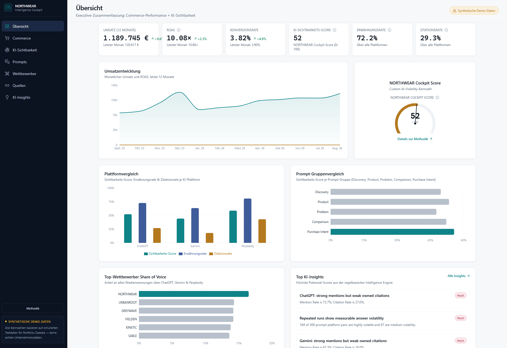
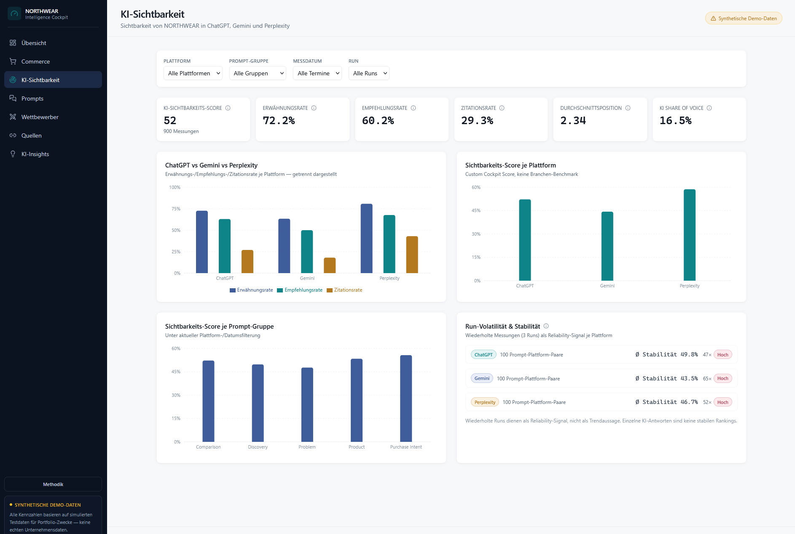
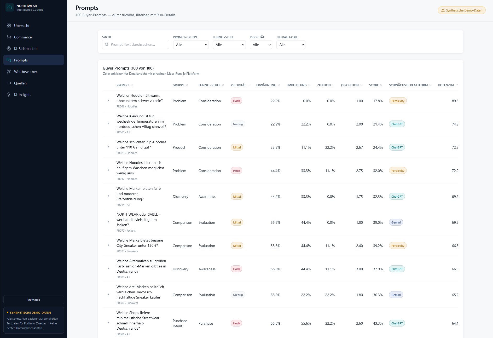
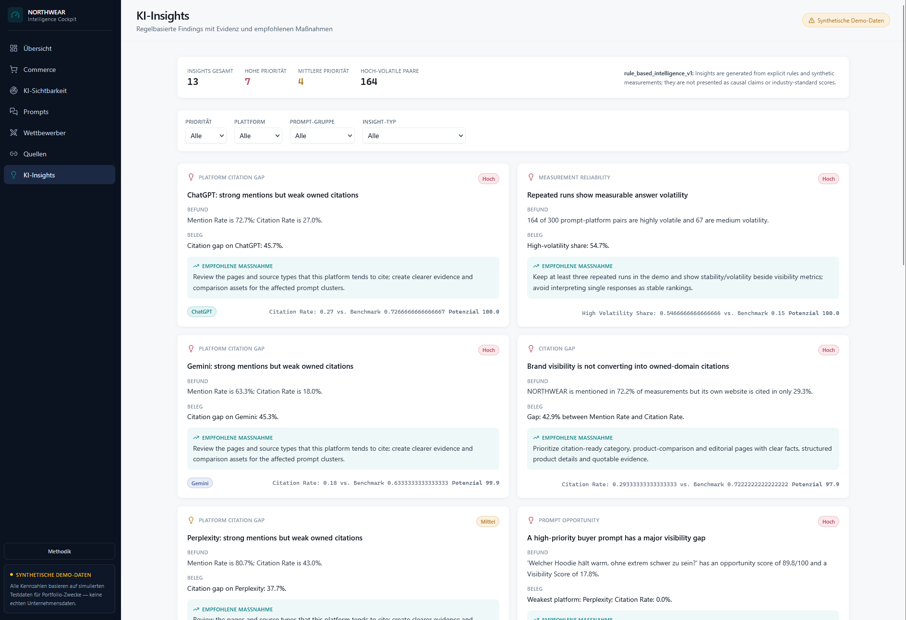

# AI Commerce Intelligence Cockpit

**E-Commerce Performance meets AI Visibility Intelligence.**

A portfolio analytics project that combines traditional e-commerce KPIs with AI/GEO visibility measurement, prompt tracking, competitor intelligence, citation analysis and rule-based actionable insights.

**Live Demo:**
https://ai-commerce-intelligence-cockpit.vercel.app/

> **Synthetic Demo Data:** NORTHWEAR is a fictional D2C brand. All commerce and AI visibility measurements in this project are simulated for portfolio and demonstration purposes. No live ChatGPT, Gemini or Perplexity measurements are presented as real company data.

---

## Overview

Traditional e-commerce analytics answer questions such as:

* How much revenue did the shop generate?
* Which channels perform best?
* What is the conversion rate?
* Which products drive sales?

But customer discovery is increasingly happening inside AI assistants.

This project explores an additional question:

> **How visible is a brand when customers ask AI systems for products, recommendations, comparisons and purchase advice?**

The **AI Commerce Intelligence Cockpit** combines both perspectives in one dashboard.

---

## Live Dashboard

**Open the application:**
https://ai-commerce-intelligence-cockpit.vercel.app/

The dashboard contains seven main areas:

* Overview
* Commerce
* AI Visibility
* Prompts
* Competitors
* Sources
* AI Insights

---

## Screenshots

### Executive Overview



### AI Visibility Intelligence



### Prompt Intelligence



### AI Insights



---

## Core Features

### Commerce Performance

Traditional e-commerce analysis including:

* Revenue
* Orders
* Sessions
* Conversion Rate
* Average Order Value
* ROAS
* Marketing Spend
* Returns
* Product Performance
* Funnel Analysis
* Channel Performance

---

### AI Visibility Intelligence

The project introduces several AI visibility metrics:

* **Mention Rate** — how often NORTHWEAR appears in relevant AI responses
* **Recommendation Rate** — how often the brand is actively recommended
* **Citation Rate** — how often the NORTHWEAR website appears as a cited source
* **AI Share of Voice** — NORTHWEAR's share of all measured brand mentions
* **Average Position** — average ranking position when NORTHWEAR appears
* **Custom AI Visibility Score** — combined project-specific visibility metric

Results are analyzed separately for:

* ChatGPT
* Gemini
* Perplexity

This is important because different AI systems may produce different brands, recommendations and source patterns.

---

## Prompt Intelligence

The dataset contains **100 buyer-oriented prompts** across five intent groups.

### Discovery

Example:

> Which sustainable streetwear brands should I know?

### Product Research

Example:

> Which sneakers under €120 are recommended?

### Problem / Solution

Example:

> Which sneakers are suitable for walking in the city all day?

### Comparison

Example:

> What are good alternatives to Brand X?

### Purchase Intent

Example:

> Where can I buy high-quality sustainable sneakers online?

Each prompt can be evaluated across multiple AI platforms and repeated measurement runs.

---

## Repeated Measurements & Volatility

AI answers can vary even when the same prompt is repeated.

For this reason, the demo dataset uses:

**100 prompts × 3 AI platforms × 3 repeated runs = 900 AI measurements**

The dashboard includes a **Volatility Score** and **Stability Score** to show how consistent results are across repeated measurements.

This avoids treating one single AI response as a stable ranking.

---

## Competitor Intelligence

The dashboard compares NORTHWEAR with fictional competitors using:

* Overall AI Share of Voice
* ChatGPT Share of Voice
* Gemini Share of Voice
* Perplexity Share of Voice
* Brand rankings
* Platform-specific competitive gaps

Platform results remain separate instead of relying only on one blended metric.

---

## Source Intelligence

AI visibility is not only about whether a brand is mentioned.

It is also important to understand **which sources appear in AI responses**.

The project therefore analyzes source patterns such as:

* Own website
* Community platforms
* Editorial websites
* Product comparison sites
* Video platforms

The goal is to identify situations such as:

> A brand may have a strong Mention Rate while its own website is rarely cited.

This creates a potential **Citation Gap** and a clear content opportunity.

---

## Rule-Based Intelligence Engine

The project includes a transparent rule-based intelligence layer.

Instead of displaying only raw metrics, the system derives prioritized findings such as:

* Citation gaps
* Recommendation gaps
* Platform visibility gaps
* Prompt opportunities
* Source opportunities
* Competitor gaps
* Measurement volatility

Each insight contains:

* Priority
* Finding
* Evidence
* Related metric
* Opportunity score
* Recommended action

The logic is deliberately transparent rather than presented as an opaque AI prediction.

---

## Custom AI Visibility Score

The **NORTHWEAR Cockpit Score** is a custom project metric.

It is **not an industry standard**.

Version 1 uses the following weighting:

| Metric              | Weight |
| ------------------- | -----: |
| Mention Rate        |    30% |
| Recommendation Rate |    25% |
| AI Share of Voice   |    20% |
| Citation Rate       |    15% |
| Position Score      |    10% |

The weighting can be adjusted in future versions as the measurement methodology evolves.

---

## Demo Dataset

The fictional NORTHWEAR dataset contains:

| Dataset                  |     Scope |
| ------------------------ | --------: |
| Products                 |        24 |
| Commerce history         | 12 months |
| Marketing channels       |         5 |
| Buyer prompts            |       100 |
| AI platforms             |         3 |
| Runs per prompt/platform |         3 |
| AI measurements          |       900 |

### Marketing Channels

* Organic
* Google Ads
* Direct
* Social
* Email

All data is synthetic and used exclusively to demonstrate the dashboard architecture and analytical methodology.

---

## Business Impact Guardrail

The current version intentionally **does not claim that AI visibility causes revenue growth**.

A relationship such as:

```text
AI Visibility
      ↓
AI Referral Traffic
      ↓
Product Views
      ↓
Orders
      ↓
Revenue
```

would require additional real-world data such as:

* longitudinal AI visibility measurements
* AI referral traffic
* analytics data
* conversion tracking
* intervention periods

The current project treats this as a future measurement framework rather than a proven causal relationship.

---

## Tech Stack

* **Next.js**
* **TypeScript**
* **Tailwind CSS**
* **Recharts**
* **Git**
* **GitHub**
* **Vercel**

The application currently works with static CSV and JSON datasets so that the portfolio version can run without paid infrastructure.

---

## Project Structure

```text
ai-commerce-intelligence-cockpit/
├── data/
├── screenshots/
├── src/
├── .gitignore
├── next.config.js
├── package.json
├── tailwind.config.ts
├── tsconfig.json
└── README.md
```

---

## Methodology Principles

The project follows several methodological rules:

1. **Mention Rate and Citation Rate are separate metrics.**
2. **AI platforms are analyzed individually.**
3. **Repeated measurements are used to expose volatility.**
4. **The custom Visibility Score is clearly identified as project-specific.**
5. **Synthetic data is explicitly labelled.**
6. **No unsupported AI Visibility → Revenue causality is claimed.**
7. **Recommendations are derived from transparent rules and measurable gaps.**

---

## Future Roadmap

Possible next development stages include:

* URL-based company and website audits
* AI Readiness scoring
* Real AI measurement integrations
* Scheduled prompt monitoring
* Historical visibility trends
* GA4 / AI referral tracking
* Search Console integration
* Shopify / Shopware / WooCommerce integrations
* Database-backed measurement history
* Multi-company dashboards
* Automated reporting

---

## Why I Built This

The project was created as a portfolio case at the intersection of:

**E-Commerce · Analytics · SEO/GEO · AI Visibility · Data Visualization**

The goal was not simply to build another dashboard, but to design a measurement framework that explores how traditional commerce performance and emerging AI-driven customer discovery could be analyzed together.

---

## Disclaimer

NORTHWEAR and all competitors shown in this project are fictional demonstration brands.

Commerce performance, AI responses, citations, rankings and visibility measurements are synthetic demo data and should not be interpreted as real measurements from ChatGPT, Gemini, Perplexity or any real company.

---

**Live Demo:**
https://ai-commerce-intelligence-cockpit.vercel.app/
